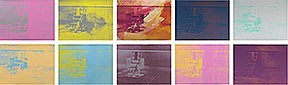

1. What is the difference between padding, margin, and borders?

Padding: A space kept between the content and the border; it separates the content of the block from its edge.

Margin: A space outside of the border; it separates a block from other blocks.

Borders: Outlines content

2. 

3. For this assignment I begin with finding the artwork I wanted to duplicate.
Next, I looked at the Example assignment resource to model my html of off. This really helped me walk through the necessary elements I needed.
Next, I worked on the style.css . There was few things that I came across that I struggled with like separating the boxes into two rows. I used photoshop to find the colors I needed for my squares.
Finally, I did my README.
